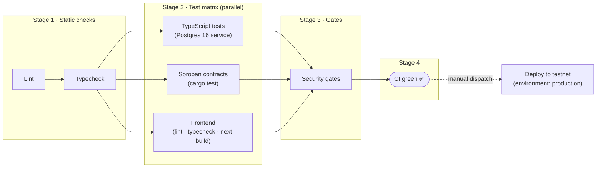

# CI/CD Pipeline

Continuous integration runs on every push and pull request to `main`
(`.github/workflows/ci.yml`). Deployment to the Stellar testnet is a separate,
manually triggered workflow (`.github/workflows/deploy.yml`) guarded by the
`production` environment.

## Pipeline stages

## Stage details

| Stage | Job | What it runs |
|-------|-----|--------------|
| 1 | **Lint** | `npm run lint` — repo hygiene (merge-conflict markers, forbidden patterns) |
| 1 | **Typecheck** | `tsc -p tsconfig.json --noEmit` over the whole monorepo |
| 2 | **TypeScript tests** | `npm run test:ts` — 17 suites (vault, auth, SDK, APIs, MPC, RFQ, CCTP, …) against a Postgres 16 service container with `npm run db:migrate` applied |
| 2 | **Soroban contracts** | `cargo test --workspace` in `contracts/stellar` plus the standalone `lean_imt` crate, with Rust build caching |
| 2 | **Frontend build** | `npm ci`, lint, `tsc --noEmit`, and `next build` in `frontend/` |
| 3 | **Security gates** | `npm run security:gates` — static security invariants (no CLI internals in services, no user secrets in service runtime, …) |
| 4 | **CI green** | Aggregation gate; branch protection can require this single check |

## Notes

- **Circuits** (`npm run circuits:test`) are excluded from CI: they require the
  Groth16 trusted-setup artifacts (`.zk-ref/**/pot*_final.ptau`) and local ZK
  reference tooling that are intentionally not committed. Run them locally with
  `npm run circuits:build && npm run circuits:test`.
- **Privy app ID**: the frontend build bakes `NEXT_PUBLIC_PRIVY_APP_ID` into the
  bundle. CI uses a placeholder unless the repository variable
  `NEXT_PUBLIC_PRIVY_APP_ID` is set.
- **Deploy** requires the `STELLAR_DEPLOYER_SECRET` secret in the `production`
  environment and is dispatch-only (Actions → Deploy → Run workflow).
